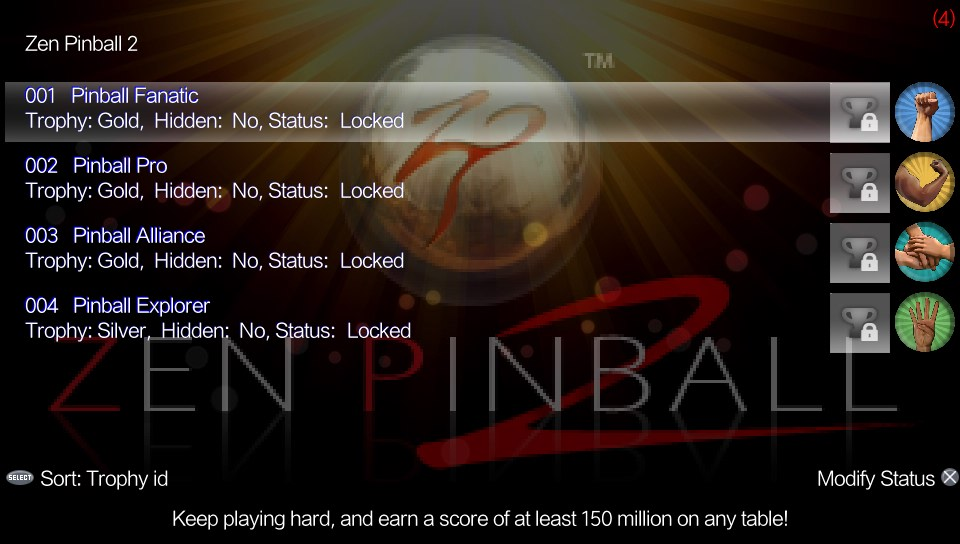
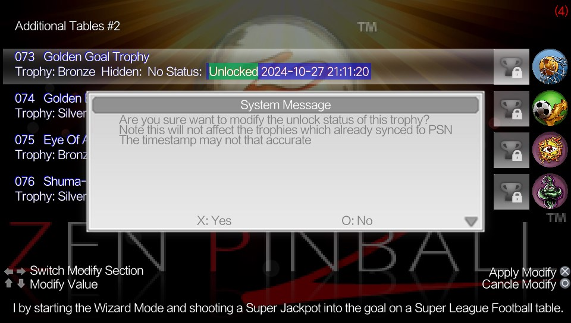

# Trophy Manager
** This app allows you to preview the trophies and their status for each game and delete trophies as desired.**

### Description ###
*This Homebrew could help you delete the game trophies you won't like to synch.*

## IMPORTANT ##
**Everytime a trophy Is deleted/modified, the trophy app/bubble  must be launched to update the trophy db, we highly recommend you to disable the wifi in the PS Vita before launching the trophy app/bubble for this matter.**

**This app doesn't use the system call to unlock the trophies, it directly modify the trophy files.**
**We highly recommend you to backup your trophies files before modify and check the modify result in trophy app/bubble offline to prevent loss**

**If your trophy disappear after modify, try L1+Triangle in Trophy Manager title screen to rebuild the trophy database. If that fail then you should maybe restore your backup. Provide the corrupted files to see if we can help locate the bug**

### Changelog 1.03 ###
- Support for trophies in homebrews and ports. 

### Changelog 1.02 ###
- Support for custom font in ux0:data/ONETROPHY/font/font.pgf. 

### Changelog 1.01 ###
- Now you can open the Trophies application. 

### Changelog 1.00 ###
-Initial Version. 

### Controls ###
*Trophy Manager does recognize the accept/cancel buttons according to console region.*

*Main Screen*

- **Square:** Multi Selection. 
- **Start:** Delete selected trophies. 
- **Select:** Sort List: Title, Progress. 
- **Triangle:** Open the system Trophy App. 
- **L1+Triangle:** Delete trophy databse and open Trophy App to force rebuild it. 

*Trophy Screen*
- **Square:** To preview details for a hidden trophy. 
- **Select:** Sort List: Trophyid, Unlocked, Hidden. 
- **Accept:** Modify trophy status. 

### NOTE: ###
*This app Is based from Trophax app, but it modify the trophies status with different way.*

### Credits ###
- Silica for his Trophax app
- Graphics By WZ-JK.
- AnalogMan151 for his [PSVTrophyIsGreat](https://github.com/AnalogMan151/PSVTrophyIsGreat)
- indefined for port the PSVTrophyIsGreat

## Donation ##
In case you want to support the work of the team on the vita, you can always donate for some coffee. Any amount is highly appreciated:

